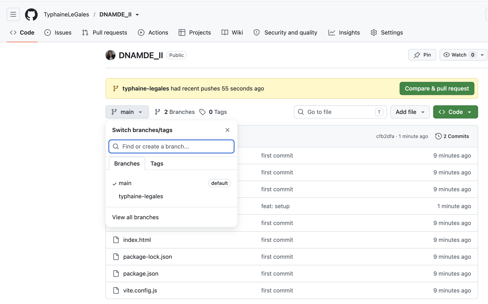
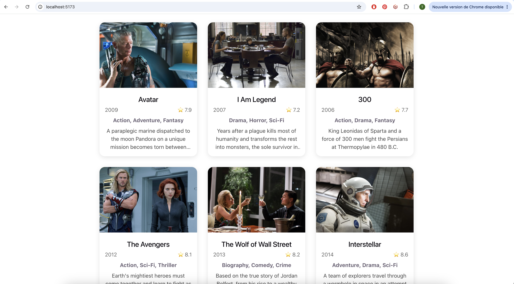
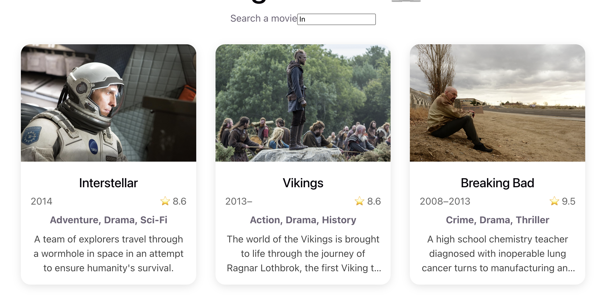
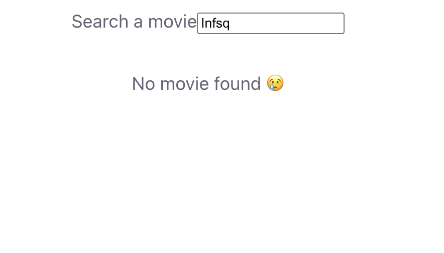
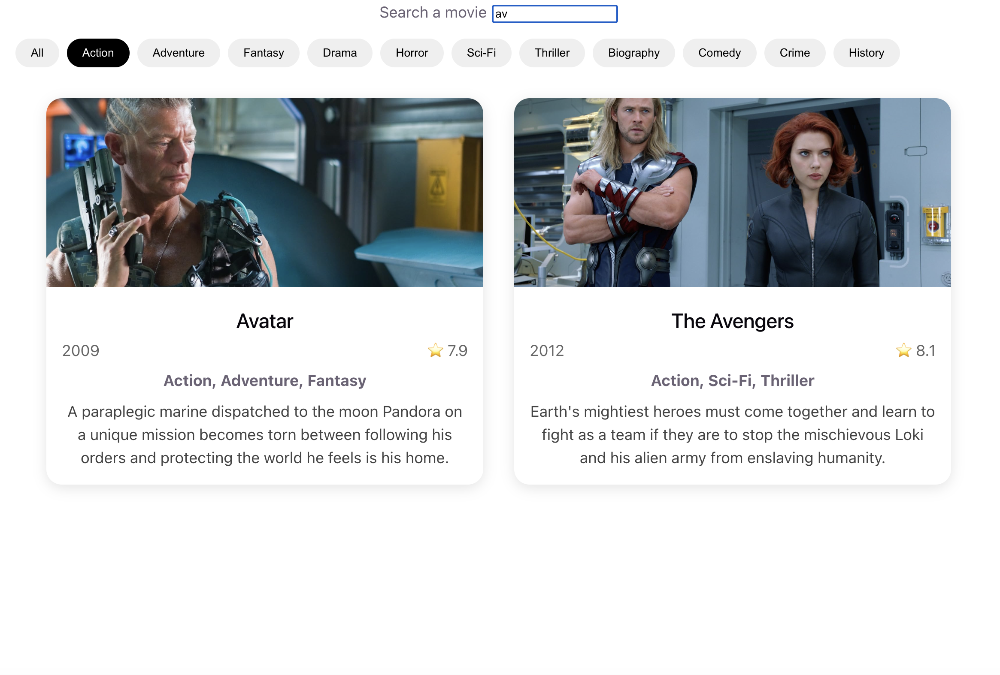
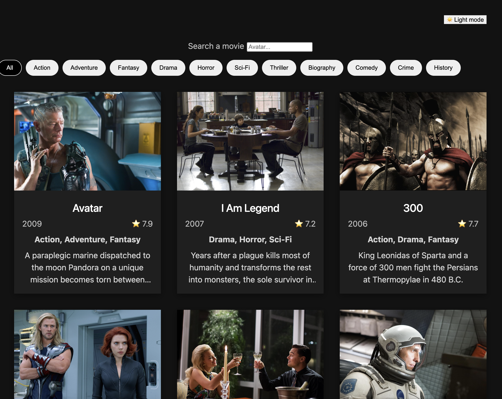
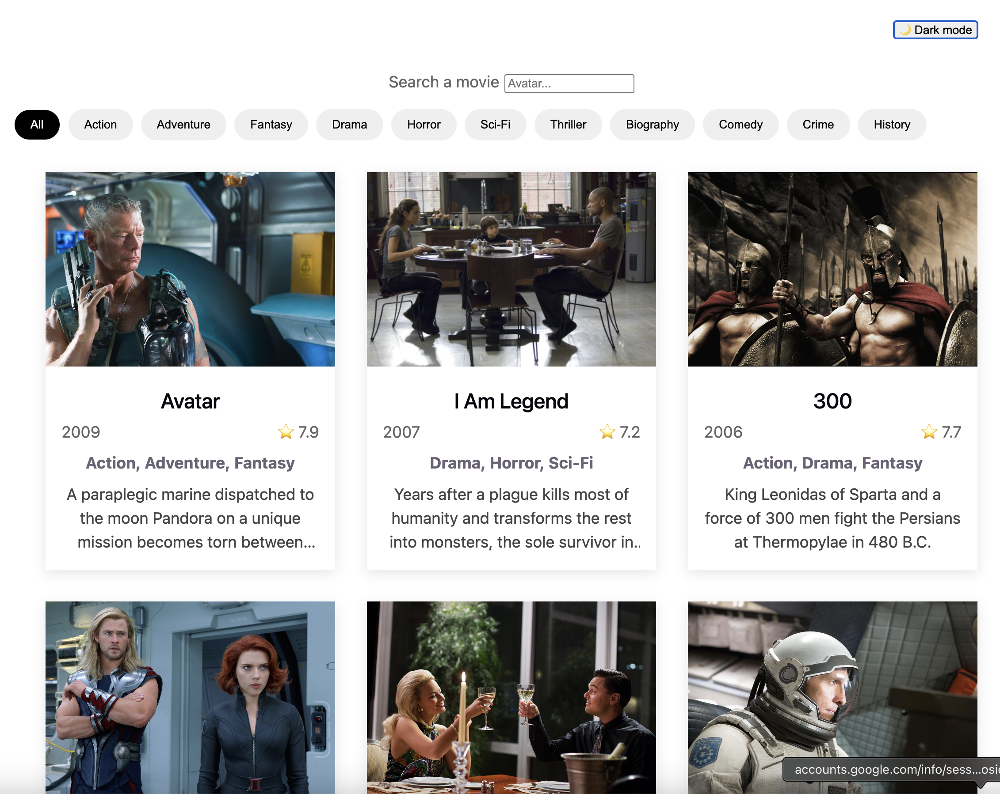

# I. SETUP ENVIRONNEMENT DE TRAVAIL

1. Clone du repo en local 
```
git clone https://github.com/TyphaineLeGales/DNAMDE_II.git
```
naviguer a l'interieur du dossier et installer les packages
```
npm i
```
tester que tout marche en lancant le serveur de dev 
```
npm run dev
```

2. Créer sa propre branche avec son nom (exemple avec mon nom typhaine-legales)
```
git checkout -b typhaine-legales
```
remplacer le texte qui s'affiche par "Bonjour {votre prénom}"

sauvegarder les modifs (remplacer le nom de ma branche par le votre)
```
git add . 
git commit -m "feat: my first commit"
git push --set-upstream origin typhaine-legales
```

quand vous retournez ici https://github.com/TyphaineLeGales/DNAMDE_II, votre branche avec votre nom devrait s'afficher ici 


# II. AFFICHER UNE LISTE DES FILMS STATIC

Utiliser la donnée contenue dans /public/filmData.json pour afficher chaque film (avec son titre, sa date de parution et son image dans une grille) comme ici 


Utiliser un composant réutilisable Film a qui l'on passe des props depuis le composant parent FilmList.

Attention : La grille doit être responsive et s'adapter au mobile

*Concepts mobilisés : importer un json, créer un composant, mapper de la donnée en liste et render un composant enfant en passant des props, css responsive*  

# III. FILTRER LA LISTE
1. Créer un input pour filtrer les films qui s'affichent selon leur titre


2. Si la recherche ne correspond a aucun résultat, afficher une phrase de "No movies found"


*Concepts mobilisés : utiliser useState - .filter() - input - onChange event, rendering conditionnel*  

3. Afficher la liste des genres dispos dans filmData.json sous forme de tags. Au click, le tag doit être selectionné (changement de CSS) et la liste doit etre filtré.
La selection par genre doit se combiné à l'input de recherche par titre



# IV. CREATING A LIGHT & DARK THEME

1. Créer un toggle dark / light pour changer le theme de l'UI. Le state de valeur du thème devra etre créer dans App à la racine de votre application react pour pouvoir etre passé a l'ensemble des composants. Penser a utiliser les variables CSS pour modifier les valeurs de couleur de fonds et de text.



*Concepts mobilisés : CSS variables, useState*  

2. REFACTOR : A ce stade de l'aventure, on commence a voir un problème avec les props de React. C'est très relou de devoir passer notre valeur de thème a tous nos composants. La on en a entre 3 et 6 mais imaginez si vous avez 200 composants. Il y a plusieurs solutions a ce problème qu'on appelle le "prop drilling" c'est a dire le fait de devoir passer la meme donnée a plusieurs niveaux de nesting des composants. 
La 1ère solution c'est l'api de Contexte développée par React https://react.dev/reference/react/createContext

*Concepts mobilisés : Context provider and consumer*  

# V. FETCHING DATA FROM AN ACTUAL API
*Concepts mobilisés : useEffect, hooks*  

# VI. ANALYZING PERFORMANCE 